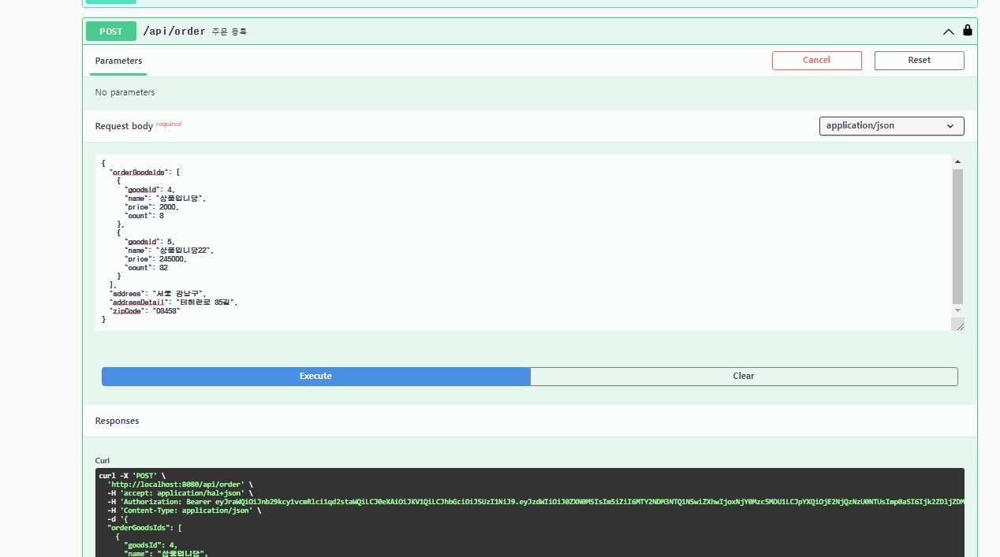

# goods-order-feature

주문,상품 기능 프로젝트입니다.
추가로
* jwt accessToken 로그인
* 배달완료 기능
* 상품조회 기능
* 주문조회 기능
* hateoas 사용하여 endpoint 응답시 리소스화

## 링크

### Local
http://localhost:8080

### h2-console
http://localhost:8080/h2-console

### Heroku (원격)
https://goods-order-feature.herokuapp.com/

## 개발언어

* Java11
* Spring Boot - 경량 프레임워크
* Spring Security - 인가/ 인증 설정으로 인해
* Jwt - 무상태성 토큰
* H2 - 인메모리 DB 사용
* JPA - ORM
* Hibernate - ORM 프레임워크
* HATEOAS - REST API 엔드포인트 변경제한으로 인한 리소스 형태로 관리
* Bean Validation - 유효성검사
* Swagger - API DOCS 사용
* Junit - 단위테스트
* Mockito - 목객체 생성
* Gradle - 빌드

## 엔티티
**상품**

|속성|설명|
|----|-----|
| goodsId | 상품아이디 |
| name | 상품명 |
| price | 가격 |

**주문**

|속성|설명|
|----|-----|
| orderId | 주문아이디 |
| orderStatus | 주문상태(주문 접수, 주문완료, 주문 취소) |
| orderGoods | 주문상품목록 |
| delivery |  배달 |

**주문상품**

|속성|설명|
|----|-----|
| orderGoodsId | 주문상품아이디 |
| goodsId | 상품아이디 |
| name | 상품명 |
| count |  갯수 |
| price | 가격 |
| orderGoodsStatus | 주문상품상태(주문 접수, 주문 취소) |

**배달**

|속성|설명|
|----|-----|
| deliveryId | 배달아이디 |
| deliveryStatus | 배달상태(준비, 완료) |
| address | 이름 |
| addressDetail | 주민번호 |
| zipCode | 이름 |

## 구현기능

### 필수 
1. 상품관리 

2. 상품관리 수정

3. 상품관리 삭제

4. 주문관리 등록(상품목록 가능)

5. 주문 부분취소(일부상품 취소/ 이력형식으로 저장) - 배달준비상태일때는 가능

6. 주문 등록 및 취소시 알림(로그출력 - event 형태로 트랜잭션 커밋후 노출)

### 선택

7. 인증/인가 - 토큰 + 로그인 사용자 관리
* jwt accesstoken 로그인

* 계정 정보

아이디: test1, 비밀번호: test1 
아이디: test2, 비밀번호: test2

8. 상품 목록 조회

9. 상품 조회

10. 주문 조회

11. 배달 완료(배달완료후 주문완료처리)

12. 배달완료 후 주문취소시(불가능)

13. 예외처리
* 공통예외처리
* 수정시 해당 리소스 미존재시 에러
* 주문취소시 미배송상태일떄 가능
* 주문취소시 취소상품목록 등록된 상품 없으면 에러반환
* 주문취소시 구매한갯수보다 취소갯수가 더많으면 반환

14. 단위테스트

* 상품 컨트롤러, 서비스 단위테스트

